# 4D-STEM Dimensionality Reduction — Autoencoder & VAE on WS₂/WSe₂

**Course:** Data Science for Electron Microscopy | FAU Erlangen-Nürnberg  
**Tools:** Python · PyTorch · NumPy · Matplotlib · scikit-learn · h5py

💻 [Notebook (report + code)](Miniproject_2.ipynb)

---

## Overview

Unsupervised dimensionality reduction of a 4D-STEM dataset from a WS₂/WSe₂ lateral heterojunction. The project reproduces the hierarchical K-means clustering of Shi et al. (2022) and extends it with fully connected autoencoder (AE) and variational autoencoder (VAE) models in PyTorch, comparing learned latent-space representations against the handcrafted STD-feature baseline.

Dataset and reference methodology: Shi et al., *npj Computational Materials* **8**, 114 (2022).

---

## Pipeline

### 1 — Data Loading, Alignment & ADF Reconstruction

The raw 4D-STEM dataset (`cbed_wide2.mat`) is loaded from HDF5 format. Probe drift is corrected by iteratively aligning the center of mass of the direct beam to sub-pixel precision. The annular dark-field (ADF) image is reconstructed by integrating diffraction intensity over high scattering angles, yielding a real-space image dominated by the heavy tungsten columns common to both WS₂ and WSe₂.

<table>
  <tr>
    <td align="center">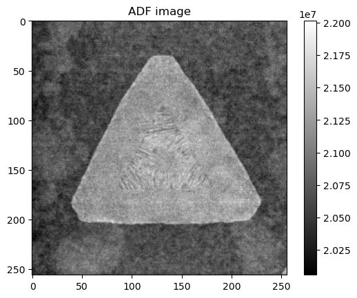</td>
  </tr>
  <tr>
    <td align="center">ADF image — WS₂/WSe₂ lateral heterojunction flake. The outer triangular region is WS₂; the inner ring is WSe₂. Tungsten-dominated contrast makes the two materials indistinguishable here.</td>
  </tr>
</table>

### 2 — Log-STD Map & Reciprocal-Space Masking

The standard deviation (STD) of diffraction intensity across all scan positions is computed per detector pixel and displayed on a log scale. An annular mask (inner radius = 24 px, outer radius = 57 px) isolates the Bragg disk signal region, excluding the direct beam and the zero-padded periphery introduced by alignment shifts. High-variance pixels within this annulus (top 30% of STD) are selected as the feature vector for each diffraction pattern, reducing the input dimensionality from the full detector array to the structurally informative diffraction signal only.

### 3 — Manifold Visualization

The STD-masked feature vectors from all scan positions are projected to 3D using UMAP for visualization. The resulting manifold reveals discrete cluster structure in diffraction space, used here as a qualitative diagnostic of how separable the material regions are before any clustering is applied.

<table>
  <tr>
    <td align="center">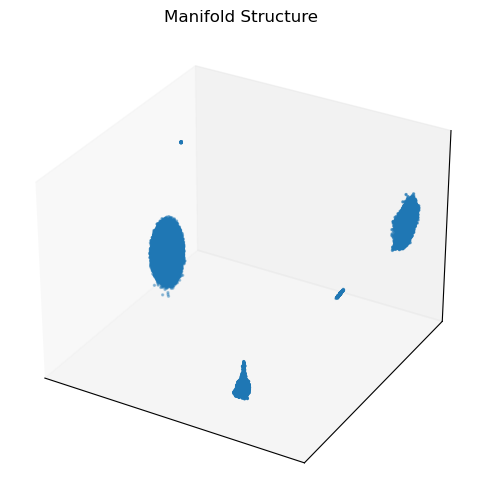</td>
  </tr>
  <tr>
    <td align="center">UMAP manifold of all diffraction patterns. Distinct point clouds correspond to background (vacuum/substrate), WS₂, and WSe₂ — confirming that the STD-masked features carry sufficient structural contrast for unsupervised separation.</td>
  </tr>
</table>

### 4 — Baseline K-means Clustering

As a baseline, K-means is applied directly to the STD-reduced feature vectors from all scan positions. This single-round clustering separates the crystalline flake from the amorphous background, confirming that the preprocessing pipeline captures the dominant structural contrast without any learned representation.

### 5 — Hierarchical Clustering (3 Levels)

A divisive hierarchical clustering scheme is applied following Shi et al. K-means is run recursively on each cluster, resolving structural features at progressively finer scales. The elbow method is used to select K at each level.

| Level | Separation achieved |
|---|---|
| 1 | Crystalline flake vs. vacuum/amorphous background |
| 2 | WS₂ domains vs. WSe₂ domains (lattice constant difference) |
| 3 | Sub-domain structure within each material (rotation, ripple, strain) |

<table>
  <tr>
    <td>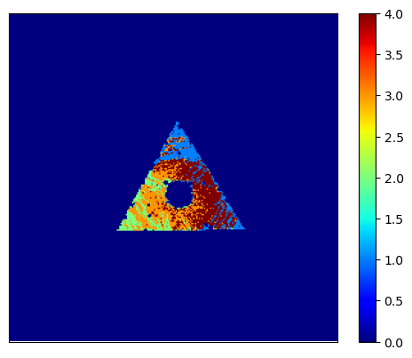</td>
    <td>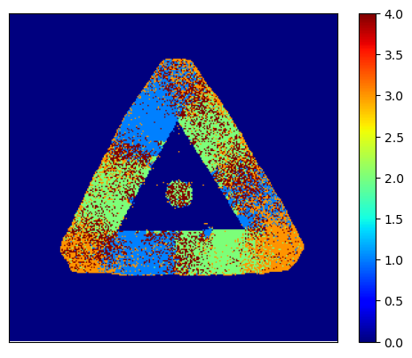</td>
  </tr>
  <tr>
    <td align="center">Hierarchical clustering — WS₂ sub-domains (level 2)</td>
    <td align="center">Hierarchical clustering — WSe₂ sub-domains (level 2)</td>
  </tr>
</table>

---

## Autoencoder-Based Clustering

A fully connected autoencoder (AE) is trained separately on the STD-masked diffraction patterns from within the WS₂ and WSe₂ regions identified by hierarchical clustering. Architecture: encoder and decoder each with one hidden layer (hidden_dim = 512), latent dimension = 8, ReLU activations, MSE reconstruction loss, trained for 40 epochs. K-means (K = 4) is applied to the latent codes to produce sub-domain cluster maps.

<table>
  <tr>
    <td>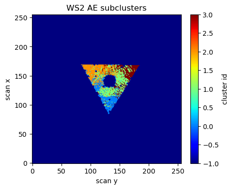</td>
    <td>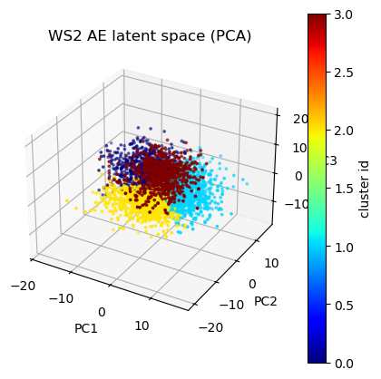</td>
  </tr>
  <tr>
    <td align="center">AE — WS₂ sub-domain cluster map</td>
    <td align="center">AE — WS₂ latent space (PCA projection)</td>
  </tr>
</table>

<table>
  <tr>
    <td>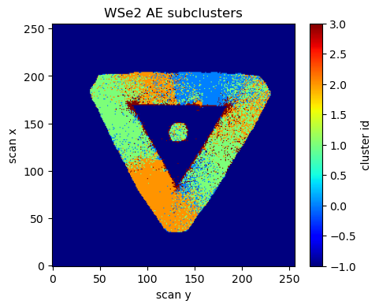</td>
    <td>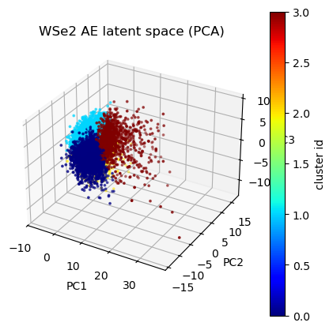</td>
  </tr>
  <tr>
    <td align="center">AE — WSe₂ sub-domain cluster map</td>
    <td align="center">AE — WSe₂ latent space (PCA projection)</td>
  </tr>
</table>

The AE latent space shows clearly separated, compact clusters in PCA projection, consistent with sharp real-space domain boundaries.

---

## Variational Autoencoder-Based Clustering

A VAE with identical architecture adds a KL divergence regularization term (kl_weight = 1e-3) that constrains the latent space to approximate a unit Gaussian. K-means is applied to the latent means μ(x) rather than sampled codes. The KL penalty enforces a smoother, more continuous latent manifold at the cost of reconstruction fidelity.

<table>
  <tr>
    <td>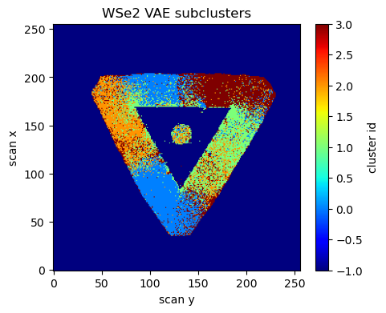</td>
    <td>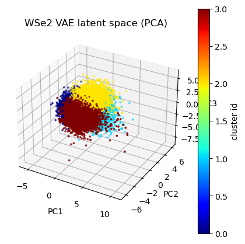</td>
  </tr>
  <tr>
    <td align="center">VAE — WS₂ sub-domain cluster map</td>
    <td align="center">VAE — WS₂ latent space (PCA projection)</td>
  </tr>
</table>

<table>
  <tr>
    <td>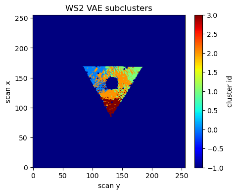</td>
    <td>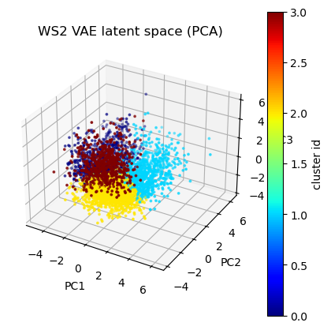</td>
  </tr>
  <tr>
    <td align="center">VAE — WSe₂ sub-domain cluster map</td>
    <td align="center">VAE — WSe₂ latent space (PCA projection)</td>
  </tr>
</table>

---

## AE vs VAE Comparison

| Metric | AE | VAE |
|---|---|---|
| WS₂ reconstruction loss | 0.757 | 0.832 |
| WSe₂ reconstruction loss | 0.827 | 0.869 |
| Cluster boundary sharpness | Higher | Smoother |
| Latent space structure | Deterministic | Probabilistic (Gaussian prior) |

The AE achieves lower reconstruction loss and sharper cluster boundaries in both material regions. The VAE's KL regularization enforces a smoother latent manifold, visible in the more diffuse PCA projections, which slightly blurs intra-material domain boundaries while preserving the large-scale material contrast. Whether this trade-off is desirable depends on the downstream task: the VAE latent space supports interpolation and generative sampling; the AE latent space is better suited for discriminative clustering of structural sub-domains.

---

## Requirements

```bash
pip install torch numpy matplotlib scikit-learn h5py umap-learn
```

---

## Usage

Open `Miniproject_2.ipynb` in Jupyter. The dataset file `cbed_wide2.mat` must be placed at the path specified in cell 4, or updated to match your local setup. The file is not included in this repository — it was provided as part of the FAU course dataset. AE and VAE training runs approximately 5 minutes on CPU per material region.

---

## Reference

Shi, C. et al. "Uncovering material deformations via machine learning combined with four-dimensional scanning transmission electron microscopy." *npj Computational Materials* **8**, 114 (2022). https://doi.org/10.1038/s41524-022-00793-9
